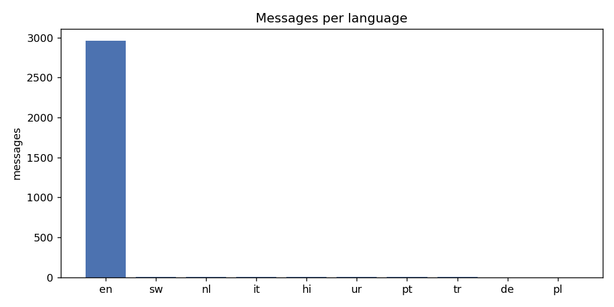
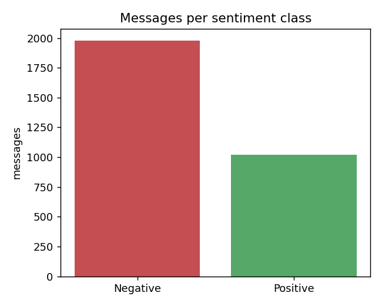
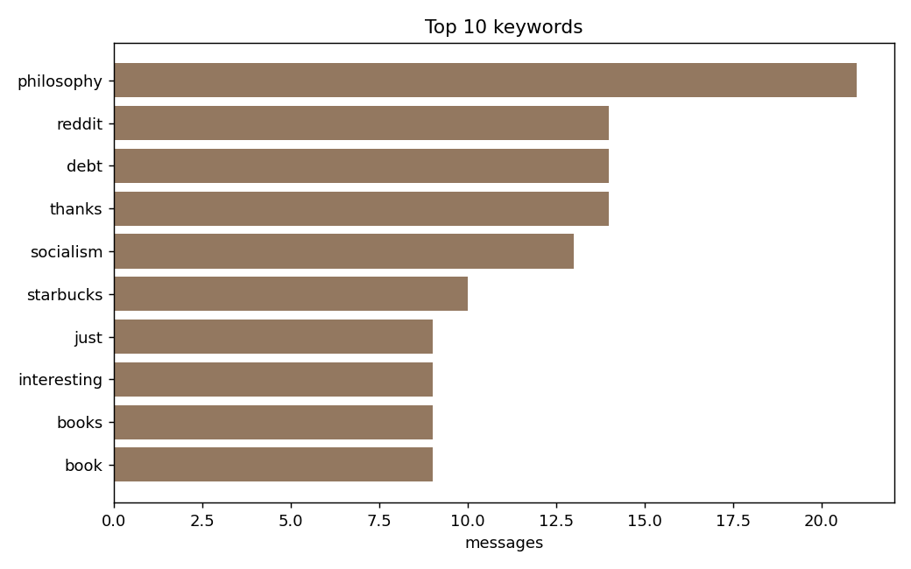

# Reddit E2E Streaming Pipeline (Kafka Capstone)

Repository: https://github.com/dchaplinsky/kafka-capstone

An end-to-end data-processing pipeline of microservices communicating through Kafka
(Redpanda). It ingests real Reddit comments, detects the language of each comment,
classifies its sentiment, extracts keywords, and reports aggregate statistics.

## Architecture

A linear enrichment pipeline. Each service is an independent process that consumes from
one topic, adds its own fields to the message, and produces to the next topic. Topics
are durable, so the services are decoupled and can start in any order.

The data flows through five topics, one processing stage between each pair:

- **generator**: reads `data/comments.jsonl`, produces to `comments.raw`
- **language**: consumes `comments.raw`, produces to `comments.lang`
- **sentiment**: consumes `comments.lang`, produces to `comments.sentiment`
- **keywords**: consumes `comments.sentiment`, produces to `comments.keywords`
- **statistics**: consumes `comments.keywords`, writes `stats.json` and `figures/*.png`

| Service | In topic | Out topic | Model |
|---|---|---|---|
| `generator` | (dataset file) | `comments.raw` | - |
| `lang_service` | `comments.raw` | `comments.lang` | `papluca/xlm-roberta-base-language-detection` |
| `sentiment_service` | `comments.lang` | `comments.sentiment` | `distilbert-base-uncased-finetuned-sst-2-english` |
| `keyword_service` | `comments.sentiment` | `comments.keywords` | KeyBERT (`all-MiniLM-L6-v2`) |
| `stats_service` | `comments.keywords` | (stats.json, figures) | - |

Each message is a JSON payload, with the key of the Reddit comment id. Fields accumulate as it
moves down the pipeline:

```json
{"id": "ebqu3hi", "subreddit": "programming", "text": "...",
 "lang": "en", "lang_score": 0.99,
 "sentiment": "Negative", "sentiment_score": 0.98,
 "keywords": ["redesign aesthetics", "vs code", "..."]}
```

## Dataset

Real Reddit comments from the public HuggingFace dataset
[`HuggingFaceGECLM/REDDIT_comments`](https://huggingface.co/datasets/HuggingFaceGECLM/REDDIT_comments)
(one split per subreddit). `scripts/fetch_dataset.py` streams a balanced sample of 3,000
comments across 15 subreddits (programming, science, history, books, personalfinance,
gaming, travel, philosophy, technology, Fitness, askscience, todayilearned,
explainlikeimfive, DIY, space) and writes them to `data/comments.jsonl`. The raw file is
not committed; run the fetcher to reproduce it.

## Requirements

- Docker + Docker Compose
- Python 3.11+ with [uv](https://docs.astral.sh/uv/)

The first run downloads the three models (~1.5 GB) into `.hf_cache/`.

## How to run

```bash
# 1. Environment
uv venv .venv
uv pip install --python .venv -r requirements.txt

# 2. Start the single-broker Redpanda cluster
docker compose up -d

# 3. Fetch the dataset (3,000 real Reddit comments)
.venv/bin/python -m scripts.fetch_dataset --rows 3000

# 4. Run the whole pipeline end to end
#    (recreates topics, starts the 4 services, runs the generator, then stops on drain)
.venv/bin/python -m scripts.run_all
```

The final aggregates are printed to the console, written to `stats.json`, and plotted to
`figures/`.

### Running the services individually

Each microservice can also be started on its own (one per terminal); they discover work
through Kafka and self-stop once the stream drains:

```bash
.venv/bin/python -m src.lang_service
.venv/bin/python -m src.sentiment_service
.venv/bin/python -m src.keyword_service
.venv/bin/python -m src.stats_service
.venv/bin/python -m src.generator          # recreate topics first with --recreate
```

## Statistics

Computed over 3,000 comments. Full numbers in [`stats.json`](stats.json).

### Messages per language

10 languages detected. The sample is English-dominant, as Reddit generally is.

| Language | Messages |
|---|---|
| en | 2963 |
| sw | 7 |
| nl | 7 |
| it | 7 |
| hi | 6 |
| ur | 3 |
| pt | 3 |
| tr | 2 |
| de | 1 |
| pl | 1 |



### Messages per sentiment class

| Sentiment | Messages | Share |
|---|---|---|
| Negative | 1980 | 66% |
| Positive | 1020 | 34% |

The SST-2 model leans negative on factual, discussion-style comments, which is the bulk
of the sample.



### Top 10 keywords

| # | Keyword | Messages |
|---|---|---|
| 1 | philosophy | 21 |
| 2 | reddit | 14 |
| 3 | debt | 14 |
| 4 | thanks | 14 |
| 5 | socialism | 13 |
| 6 | starbucks | 10 |
| 7 | just | 9 |
| 8 | interesting | 9 |
| 9 | books | 9 |
| 10 | book | 9 |



## Repository layout

```
docker-compose.yml          single-broker Redpanda
requirements.txt            Python dependencies
src/
  common.py                 config, Kafka helpers, generic enricher loop
  generator.py              dataset -> comments.raw
  lang_service.py           language detection
  sentiment_service.py      sentiment classification
  keyword_service.py        keyword extraction
  stats_service.py          aggregation -> stats.json + figures
scripts/
  fetch_dataset.py          stream the dataset to data/comments.jsonl
  run_all.py                end-to-end orchestrator
figures/                    rendered charts
stats.json                  final aggregates
```
